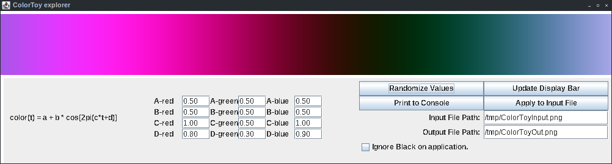

# Java-ColorToy
Java based utility to generate a color palette from a function.

# Background
I came across a web article describing how to generate a color as a function of an input value [0.0-1.0] that would result in a continuous color space.  The equation used is color(t) = a + b \* cos[2pi(c\*t+d)].  The original author's post is: http://iquilezles.org/www/articles/palettes/palettes.htm and he has a web based utility here: https://www.shadertoy.com/view/ll2GD3.  I wanted to create a Java based utility to experiment with values of the input function and see what the resulting palette would look like.

# How To Use This Program
Download all the project files.  They are:

o ColorToy.java (The main class for the project)

o MainPanel.java (Holds a ColorToyPanel and a ControlPanel)

o ColorToyPanel.java (Draws the color spectrum)

o ControlPanel.java (Holds input fields and buttons)

o LoadImageUtil.java (performs image file I/O and color palette application)

o Canvas.java (a draw-able surface)

o Point.java (x-y point class for use with Canvas)

Compile the project with: `javac *.java`

Then run: `java ColorToy`

The Random button scrambles all parameter values.

The Update button redraws the color bar.

The Print button outputs the function parameters to the system Console.

The Apply button maps the currently displayed palette on the image file specified by the Input File Path, and writes the output to a file specified by the Output File Path.  TIFF, PNG, JPEG, and BMP file types are supported.

# Demos
Example Input File
![Example Input File(ColorToyInput_demo.png "Input Example")
Example Output File
![Example Output File(ColorToyOut_demo.png "Output Example")
